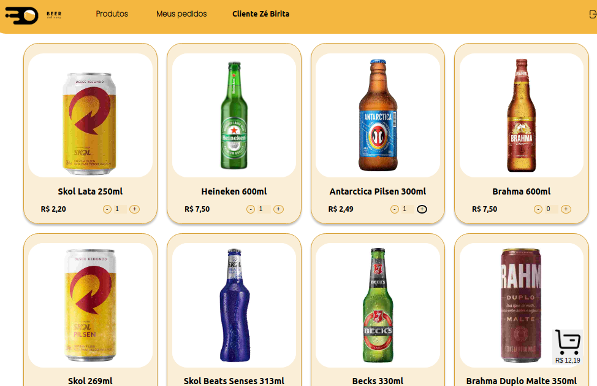
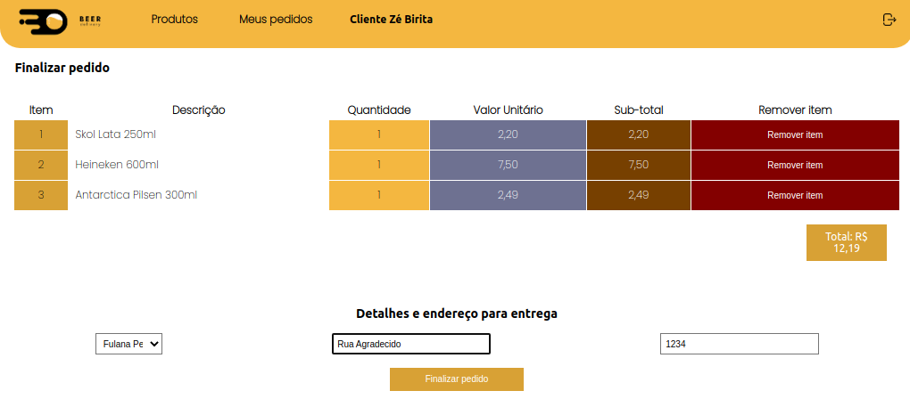
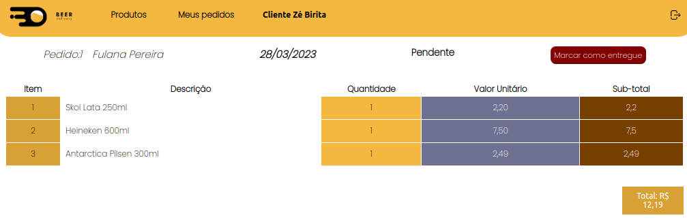
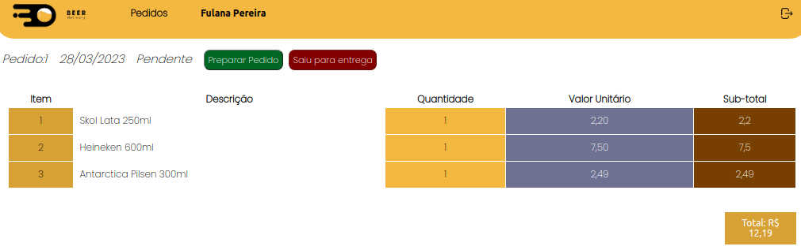
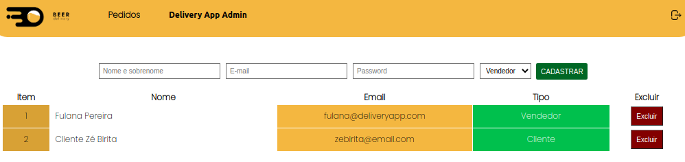

# Boas vindas ao repositório do projeto Beer Delivery!

Este projeto foi desenvolvido por mim e meu grupo durante o curso de desenvolvimento web da Trybe.

Esta projeto simula uma aplicação estilo ifood sendo que para pedidos de bebidas.

A aplicação Beer Delivery trabalha com empresas parceiras(vendedor) das quais os clientes fazem seus pedidos e o empresa parceira(vendedor) é acionada para realizar a entrega.

A aplicação é completa com front-end, back-end, incluindo banco de dados MYSQL. 
O MySQL estar instalado na maquina para rodar o back-end e permitir o acesso de login do usuario.

A aplicação inicia com a tela de login.
(./assets/readme/beer-delivery-login.png)

<strong>A aplicação é dividida em 3 espaços após o login, um para cada tipo de usuario: </strong>

- <strong>clientes</strong>- fazerem os pedidos, que serão adicionados aos carrinhos e finalizarem o pedido.clique no simbolo de "+" nos produtos aparecerá um "carrinho" no canto inferior direito, clique nele e poderá finalizar o seu pedido, após isso poderá ver o seu pedido na parte superior da tela em "meus pedidos".
  

    

      <strong>telas para o cliente</strong>
    
 

  

  

  

  

  
- vendedores- permite as empresas parceiras(vendedor) visualizarem os pedidos feitos pelos clientes.
  

    

      <strong>telas para o vendedor</strong>
    
 
    
    
  

- administradores- uma para a empresa Beer Delivery poder administrar os seus usuarios cadastrados, tanto empresas parceiras quanto clientes, podendo adicionar ou remover.
  

    

      <strong>telas para o adminstrador</strong>
    
 
    
  

## Para ter acesso após o login poderá usar os logins que já estão no banco de dados MySQL.
  cliente- login: `zebirita@email.com`   senha: `$#zebirita#$`

  vendedor- login: `fulana@deliveryapp.com`   senha: `fulana@123`

  administrador- `login: adm@deliveryapp.com`   senha: `--adm2@21!!--`
 
  As senhas que estão no banco de dados estão salvas com hash md5
 (./assets/readme/usuarios-bd.png)

## Caso queria adiconar um usuario para logar
  pelo botão "não tenho uma conta" na tela de login poderá criar um novo usuário para logar, 
  ao criar um novo usuario deverá respeitar.
- A senha recebe qualquer tipo de caractere;
- Aqui, os critérios para considerar os dados mal formatados são:
- Nome completo com número de caracteres maior que 12.
- Email incompleto, fora de um padrão comum: <email>@<domínioPrincipal>.<domínioGenérico>;
- Senha com número de caracteres maior que 6.

  

    <strong>‼️ caso prático da aplicação !!</strong>
  
 
  **Neste projeto, seu grupo deve desenvolver um app de delivery para uma distribuidora de bebidas. Veja abaixo o contexto da entrega que deve ser feita:**

  A distribuidora de cervejas da dona Tereza está se informatizando! 🚀 Seu negócio, antes focado em um local específico da cidade, passou a receber uma quantidade massiva de encomendas de outros pontos, expandindo sua atuação via delivery. Isso tudo graças ao excelente preço das bebidas e atendimento da equipe de vendas.

  Agora a distribuidora possui alguns pontos de venda na cidade para agilizar no atendimento dessas áreas. Cada ponto de venda, por sua vez, possui uma pessoa vendedora responsável.

  Como seu antigo sistema, que era um conjunto de planilhas, já não atende a necessidade do negócio por gerar muita manutenção, dona Tereza procurou a sua equipe de pessoas desenvolvedoras com uma ideia de aplicativo que pudesse agilizar a vida de sua equipe e das pessoas que compram seus produtos. O aplicativo precisa:

  - Ter acesso via login: tanto clientes como pessoas vendedoras, assim como a própria dona Tereza, que administra o sistema, devem ter acesso ao aplicativo via login, porém para funções diferentes: (1) A pessoa cliente, que compra da lista de produtos; (2) A pessoa vendedora, que aprova, prepara e entrega; (3) A pessoa administradora, que gerencia quem usa o aplicativo;
  - Fazer a comunicação entre clientes e pessoas vendedoras: a pessoa cliente faz o pedido via "carrinho de compras" e a pessoa vendedora aprova, prepara e envia esse pedido. Quando o produto é recebido por quem comprou, essa pessoa marca o pedido como "recebido". Ambos devem possuir detalhes sobre seus pedidos;
  - Se a pessoa cliente faz o pedido, o mesmo deve aparecer para a pessoa vendedora em seu dash de pedidos após a atualização da página. A pessoa cliente, por sua vez, deve ter as informações sobre seu pedido quando sua página for atualizada, ou seja, ter informações se o pedido está sendo preparado ou se já saiu pra entrega;

  Sua equipe, que já possui uma boa experiência com desenvolvimento, em pouco tempo apresentou um protótipo e um [Diagrama de ER](./assets/readme/eer.png) conforme imagem:

  

  A ideia da sua equipe já pressupõe alguma escalabilidade, dado que foram estabelecidas algumas entidades genéricas no banco de dados e componentização no front-end, para que, caso o sistema cresça, não seja muito difícil mudar e ampliar essa estrutura.

  **A proposta encantou, mas dona Tereza quer ver o negócio em ação! Ela está disposta a pagar por um MVP do projeto e vocês fecharam o negócio com um prazo combinado para entrega.**

  Agora é mãos à obra! Vamos começar a aplicação?

# Orientações

  

    <strong>‼️ instalando este projeto !!</strong>
  
 

  1. Clone o repositório
  - entre na pasta que deseja instalar e abra o terminal.
  - Use o comando: `git clone git@github.com:th-maia/beer-delivery.git`.
  - Entre na pasta do repositório que você acabou de clonar:
    - `cd sd-021-b-project-delivery-app`
  - Vá para a branch main caso não esteja, `git checkout main`.

  2. Instale as dependências

  - Para isso, use o seguinte comando: `npm install`, 
      caso dê algum erro tente rodar novamente o comando acima, pode ocorrer por diferentes versões ou pacotes que foram instalados após outros.
  
  3. Execute arrume as configações do banco de dados no arquivo ".env" na pasta back-end para as do seu usuario e senha do MYSQL da sua maquina, mundando MYSQL_USER e o MYSQL_PASSWORD
     (./assets/readme/db-enviroment.png)

  4. ative o mysql com o comando: `sudo systemctl start mysql`.
      verifique se o mysql esta ativo com o `sudo systemctl status mysql`
  
  5. rode o comando para iniciar a aplicação: `npm start`
      este comando demora alguns minutos, se tudo der certo irá aparecer a pagina web. 
      se aparecer um erro `ERROR: connect ECONNREFUSED 127.0.0.1:3306` provavelmente você não configurou MYSQL corretamente, no passo 3 ou não executou o passo 4 corretamente.

  6. quando quiser parar a aplicação rode o `npm stop`

  

    <strong>🪛 Scripts relevantes do <code>package.json</code> principal</strong>
  
 

  **Observação:** nesse projeto, utilizamos o gerenciador de processos `pm2`. Caso você queira entender melhor o que são gerenciadores de processos Node, dê uma conferida.

  **São os scripts da raiz do projeto (`./package.json`) e não das aplicações individuais `./front-end/package.json` e `./back-end/package.json`**:

  - `start`: Limpa as portas `3000` e `3001` e simula a inicialização no avaliador. Também prepara o campo rodando o `Sequelize` para restaurar o **banco de dados de testes** (final `-test`) e sobe a aplicação com `pm2` em modo `fork` (uma instância para cada aplicação). Nesse modo, as alterações não são assistidas;
    - *uso (na raiz do projeto): `npm start`*

  - `stop`: Para e deleta as aplicações rodando no `pm2`;
    - *uso (na raiz do projeto): `npm stop`*

  - `dev`: Limpa as portas `3000` e `3001` e sobe a aplicação com `pm2` em modo `fork` (uma instância pra cada aplicação). Nesse modo, as atualizações são assistidas (modo `watch`);
    - *uso (na raiz do projeto): `npm run dev`*

  - `dev:prestart`: A partir da raiz, esse comando faz o processo de instalação de dependências (`npm i`) nos dois projetos (`./front-end` e `./back-end`) e roda o `Sequelize` no `./back-end` (lembrar de configurar o `.env` no mesmo);
    - *uso (na raiz do projeto): `npm run dev:prestart`*

  - `db:reset`: Roda os scripts do `Sequelize` restaurando o **banco de dados de desenvolvimento** (final `-dev`). Utilize esse script caso ocorra algum problema no seu banco local;
    - *uso (na raiz do projeto): `npm run db:reset`*

  - `db:reset:debug`: Roda os scripts do `Sequelize` restaurando o **banco de dados de desenvolvimento** (final `-dev`). Utilize esse script caso ocorra algum problema no seu banco local. Esse comando também é capaz de retornar informações detalhadas de erros (quando ocorrerem no processo);
    - *uso (na raiz do projeto): `npm run db:reset:debug`*

  - `test <nomes-dos-arquivos>`: Roda todos os testes (ou uma parte deles caso `<nomes-dos-arquivos>` seja definido) utilizando o **banco de dados de testes** (final `-test`);
    - *uso (na raiz do projeto): `npm test`, `npm test 01login 02register` ou ainda `npm run test 01 02`*

  - `test:dev <nomes-dos-arquivos>`: Roda todos os testes (ou uma parte deles caso `<nomes-dos-arquivos>` seja definido) utilizando o **banco de dados de desenvolvimento** (final `-dev`); 
    - *uso (na raiz do projeto): `npm run test:dev`, `npm run test:dev 01login 02register` ou ainda `npm test:dev 01 02`*;

  - `test:dev:open <nomes-dos-arquivos>`: Roda todos os testes (ou uma parte deles caso `<nomes-dos-arquivos>` seja definido) utilizando o **banco de dados de desenvolvimento** (final `-dev`), exemplo `npm test:dev:open 01login 02register` ou ainda `npm test:dev:open 01 02`. Esse teste deve abrir uma janela mostrando o comportamento das páginas;
    - *uso (na raiz do projeto): `npm run test:dev:open`, `npm run test:dev:open 01login 02register` ou ainda `npm test:dev:open 01 02`*;

  - `test:dev:report "<nomes-dos-arquivos>"`: Roda todos os testes (ou uma parte deles caso `"<nomes-dos-arquivos>"` seja definido) utilizando o **banco de dados de desenvolvimento** (final `-dev`). Esse teste devolve um output em texto com o resultado de todos os testes. Os `logs` são gerados em `./__tests__/reports`.
    - *uso (na raiz do projeto): `npm run test:dev:report`, `npm run test:dev:report "01login 02register"` ou ainda `npm run test:dev:report "01 02"`*;

  

    <strong>🎛 Linter</strong>
  
 

  ## ESLint

  Para fazer a análise estática do seu código neste projeto, vamos utilizar o linter [ESLint](https://eslint.org/). Assim o código estará alinhado com as boas práticas de desenvolvimento, sendo mais legível e de fácil manutenção!

  ➡️ Este projeto já vem com as dependências relacionadas ao _linter_ configuradas nos arquivos `package.json` nos seguintes caminhos:
    - `sd-021-b-project-delivery-app/back-end/package.json`
    - `sd-021-b-project-delivery-app/front-end/package.json`
    
  ➡️ Para poder rodar o `ESLint` basta:

  - Executar o comando `npm install` dentro do projeto, de forma individual, ou seja, execute esse comando dentro da pasta `back-end` e também na pasta `front-end`;

  - Depois execute o comando `npm run lint` dentro de cada uma dessas pastas, assim você verifica as particularidades individualmente;

  - Se a análise do `ESLint` encontrar problemas no seu código, eles serão mostrados no seu terminal. 
  - Se não houver problema no seu código, nada será impresso no seu terminal.

  ## StyleLint

  ➡️ Usaremos também o [StyleLint](https://stylelint.io/) para fazer a análise estática do seu código, especialmente em Front-end. 

  ➡️ Para poder rodar o `StyleLint` em um projeto basta:

  - Executar o comando `npm install` dentro do projeto de front-end;

  - Depois execute o comando `npm run lint:styles`;

  - Se a análise do `StyleLint` encontrar problemas no seu código, tais problemas serão mostrados no seu terminal;
  -  Se não houver problema no seu código, nada será impresso no seu terminal.

  ⚠️ **Importante**: o Stylelint é aplicável apenas no front-end.

  > ⚠️ **Importante**: Pull Requests com issues de Linter não serão avaliadas. Atente-se para resolvê-las antes de finalizar o desenvolvimento.

  

    <strong>🏦 Banco de dados e Sequelize</strong>
  
 

  ## Banco de dados

  Para o banco de dados, utilizamos o ORM `Sequelize`, que fará interface com o `MySQL`.
  - O [Diagrama de ER](./assets/readme/eer.png) também pode ajudar a "visualizar" o banco de dados;

  ## Sequelize

  ⚠️ **A configuração do sequelize pode ser considerado o requisito zero do projeto**, dado que a maior parte dos testes dependem da estrutura de alguma tabela para realização de testes, **portanto, deve ser feita primeiro**.

  ⚠️ Antes de iniciar o projeto, garanta que o Sequelize roda corretamente no `./back-end` (pela raiz do projeto, o comando `npm run db:reset` será de grande ajuda, pois serve para restaurar o banco de dados `-dev`). O avaliador vai executar funções do sequelize para garantir a estrutura do banco de dados.

  O projeto já provê uma estrutura inicializada do ORM (em `./back-end/src/database`). Aqui, é necessário que você desenvolva as **migrations** e **seeders** corretamente, seguindo o modelo em `./db.example.sql` (esse arquivo serve como referência, e não tem qualquer influência sobre a aplicação ou avaliação).

  ⚠️ O avaliador usará valores `default` no arquivo `./back-end/src/database/config/config.js`, que já vem no projeto caso nada seja definido. Portanto, tome cuidado na hora de fazer qualquer alteração nesse arquivo, pois é através dele que o avaliador utilizará as referências do banco de dados correto para cada situação (desenvolvimento e testes).

  - Esse projeto fornece por padrão o arquivo `.sequelizerc` em `.back-end` para configurações do padrão de pastas no Sequelize.

  - **Opcionalmente no desenvolvimento local, você pode alterar o valor `EVAL_ALWAYS_RESTORE_DEV_DB` do arquivo `.env` em `./back-end` para `false`**, o que persistirá os dados dos testes locais durante os mesmos. Essa opção pode gerar implicações para a performance e confiabilidade do teste local, já que o avaliador pode se comportar mal caso haja uma quantidade grande de registros para avaliar. Caso ocorra algum problema, utilize o comando `npm run db:reset` ou `npm run db:reset:debug` (para encontrar erros) pela raiz do projeto para restaurar o banco, ou altere de volta a opção `EVAL_ALWAYS_RESTORE_DEV_DB` para `true`.

