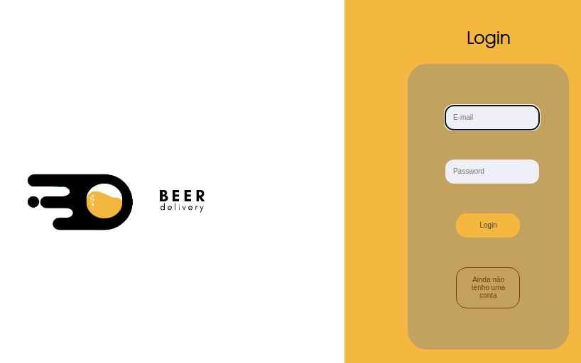
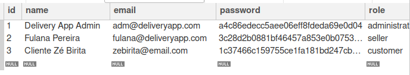
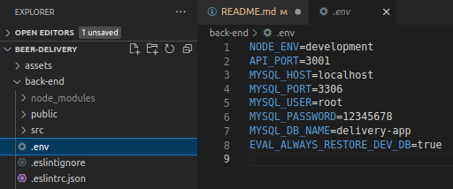

# Boas vindas ao repositório do projeto Beer Delivery!

Este projeto foi desenvolvido por mim e meu grupo durante o curso de desenvolvimento web da Trybe.

Esta projeto simula uma aplicação estilo ifood sendo que para pedidos de bebidas.

A aplicação Beer Delivery trabalha com empresas parceiras(vendedor) das quais os clientes fazem seus pedidos e o empresa parceira(vendedor) é acionada para realizar a entrega.

A aplicação é completa com <strong>front-end</strong>, <strong>back-end</strong>, incluindo banco de dados MYSQL. 

O <strong>MySQL</strong> esta instalado na máquina para rodar o back-end e permitir o acesso de login do usuario.

A aplicação inicia com a <strong>tela de Login</strong>.

**A aplicação é dividida em 3 espaços após o login, um para cada tipo de usuario:**

- <strong>clientes</strong>- espaço para os clientes fazerem os pedidos, que serão adicionados aos carrinhos e finalizarem o pedido. para adicionar produtos ao seu carrinho clique no simbolo de "+" nos produtos e aparecerá um "carrinho" no canto inferior direito, clique nele, preencha quem irá fazer a entrega e o endereço e numero e poderá finalizar o seu pedido, após isso poderá ver o seu pedido na parte superior da tela em "meus pedidos".

  

  

  

  

  
- <strong>vendedores</strong>- permite as empresas parceiras(vendedor) visualizarem os pedidos feitos pelos clientes e seus status e modifica-los.
  

    

      <strong>telas para o vendedor</strong>
    
 

    

    

  

- <strong>administradores</strong>- espaço para a empresa Beer Delivery poder administrar os seus usuarios cadastrados, tanto empresas parceiras quanto clientes, podendo adicionar ou remover.
  

    

      <strong>telas para o adminstrador</strong>
    
 

    

  

## Para realizar o login e ter acesso a alicação poderá usar os logins que já estão no banco de dados MySQL.
  <strong>cliente</strong>- login: `zebirita@email.com`   senha: `$#zebirita#$`

  <strong>vendedor</strong>- login: `fulana@deliveryapp.com`   senha: `fulana@123`

  <strong>administrador</strong>- `login: adm@deliveryapp.com`   senha: `--adm2@21!!--`
 
  As senhas que estão no banco de dados estão salvas com hash md5.

 

## Caso queria adiconar um usuario para logar
  pelo botão "não tenho uma conta" na tela de login poderá criar um novo usuário para logar, 
  ao criar um novo usuario deverá respeitar.
- A senha recebe qualquer tipo de caractere;
- Nome completo com número de caracteres maior que 11.
- Email deve estar em um padrão comum: <email>@<domínioPrincipal>.<domínioGenérico>;
- Senha com número de caracteres maior que 5.

  

    <strong>‼️ caso prático para qual a aplicação foi desenvolvida !!</strong>
  
 
  **Neste projeto, seu grupo deve desenvolver um app de delivery para uma distribuidora de bebidas. Veja abaixo o contexto da entrega que deve ser feita:**

  A distribuidora de cervejas da dona Tereza está se informatizando! 🚀 Seu negócio, antes focado em um local específico da cidade, passou a receber uma quantidade massiva de encomendas de outros pontos, expandindo sua atuação via delivery. Isso tudo graças ao excelente preço das bebidas e atendimento da equipe de vendas.

  Agora a distribuidora possui alguns pontos de venda na cidade para agilizar no atendimento dessas áreas. Cada ponto de venda, por sua vez, possui uma pessoa vendedora responsável.

  Como seu antigo sistema, que era um conjunto de planilhas, já não atende a necessidade do negócio por gerar muita manutenção, dona Tereza procurou a sua equipe de pessoas desenvolvedoras com uma ideia de aplicativo que pudesse agilizar a vida de sua equipe e das pessoas que compram seus produtos. O aplicativo precisa:

  - Ter acesso via login: tanto clientes como pessoas vendedoras, assim como a própria dona Tereza, que administra o sistema, devem ter acesso ao aplicativo via login, porém para funções diferentes: (1) A pessoa cliente, que compra da lista de produtos; (2) A pessoa vendedora, que aprova, prepara e entrega; (3) A pessoa administradora, que gerencia quem usa o aplicativo;
  - Fazer a comunicação entre clientes e pessoas vendedoras: a pessoa cliente faz o pedido via "carrinho de compras" e a pessoa vendedora aprova, prepara e envia esse pedido. Quando o produto é recebido por quem comprou, essa pessoa marca o pedido como "recebido". Ambos devem possuir detalhes sobre seus pedidos;
  - Se a pessoa cliente faz o pedido, o mesmo deve aparecer para a pessoa vendedora em seu dash de pedidos após a atualização da página. A pessoa cliente, por sua vez, deve ter as informações sobre seu pedido quando sua página for atualizada, ou seja, ter informações se o pedido está sendo preparado ou se já saiu pra entrega;

  Sua equipe, que já possui uma boa experiência com desenvolvimento, em pouco tempo apresentou um protótipo e um [Diagrama de ER](./assets/readme/eer.png) conforme imagem:

  

  A ideia da sua equipe já pressupõe alguma escalabilidade, dado que foram estabelecidas algumas entidades genéricas no banco de dados e componentização no front-end, para que, caso o sistema cresça, não seja muito difícil mudar e ampliar essa estrutura.

  **A proposta encantou, mas dona Tereza quer ver o negócio em ação! Ela está disposta a pagar por um MVP do projeto e vocês fecharam o negócio com um prazo combinado para entrega.**

  Agora é mãos à obra! Vamos começar a aplicação?

# Orientações de INSTALAÇÃO DO PROJETO

  1. Clone o repositório
  - Entre na pasta que deseja instalar no terminal.
  - Use o comando: `git clone git@github.com:th-maia/beer-delivery.git`.
  - Entre na pasta do repositório que você acabou de clonar:
    - `cd beer-delivery`

  2. Instale as dependências

  - Para isso, use o seguinte comando: `npm install`, 
      caso dê algum erro tente rodar novamente o comando acima, pode ocorrer por diferentes versões ou pacotes que foram instalados após outros.
  
  3. Crie as configações de ambiente do banco de dados, para isso crie o arquivo `.env` dentro da pasta `back-end` para as configurações do seu usuario e senha do MYSQL da sua maquina, mundando <strong>MYSQL_USER</strong> e o <strong>MYSQL_PASSWORD</strong> para os do seu usuario MYSQL na sua maquina local. como na imagem abaixo.
  
  

  NODE_ENV=development

  API_PORT=3001

  MYSQL_HOST=localhost

  MYSQL_PORT=3306

  MYSQL_USER=root

  MYSQL_PASSWORD=12345678

  MYSQL_DB_NAME=delivery-app

  EVAL_ALWAYS_RESTORE_DEV_DB=true

  4. ative o mysql com o comando: `sudo systemctl start mysql`.
      verifique se o mysql esta ativo com o `sudo systemctl status mysql`, saia com "q"
  
  5. rode o comando para iniciar a aplicação: `npm start`
      este comando demora alguns minutos, se tudo der certo irá aparecer a pagina web.
      se aparecer o erro `ERROR: Access denied for user 'root'@'localhost'`, vocẽ não deve ter criado o arquivo ".env" no passo 3 corretamente.
      se aparecer um erro `ERROR: connect ECONNREFUSED 127.0.0.1:3306`,
      provavelmente você não ativou MYSQL corretamente, no passo 4

  6. quando quiser parar a aplicação rode o `npm stop`

  

    <strong>🪛 Scripts relevantes do <code>package.json</code> principal</strong>
  
 

  **Observação:** nesse projeto, utilizamos o gerenciador de processos `pm2`. Caso você queira entender melhor o que são gerenciadores de processos Node, dê uma conferida.

  **São os scripts da raiz do projeto (`./package.json`) e não das aplicações individuais `./front-end/package.json` e `./back-end/package.json`**:

  - `start`: Limpa as portas `3000` e `3001` e simula a inicialização no avaliador. Também prepara o campo rodando o `Sequelize` para restaurar o **banco de dados de testes** (final `-test`) e sobe a aplicação com `pm2` em modo `fork` (uma instância para cada aplicação). Nesse modo, as alterações não são assistidas;
    - *uso (na raiz do projeto): `npm start`*

  - `stop`: Para e deleta as aplicações rodando no `pm2`;
    - *uso (na raiz do projeto): `npm stop`*

  - `dev`: Limpa as portas `3000` e `3001` e sobe a aplicação com `pm2` em modo `fork` (uma instância pra cada aplicação). Nesse modo, as atualizações são assistidas (modo `watch`);
    - *uso (na raiz do projeto): `npm run dev`*

  - `dev:prestart`: A partir da raiz, esse comando faz o processo de instalação de dependências (`npm i`) nos dois projetos (`./front-end` e `./back-end`) e roda o `Sequelize` no `./back-end` (lembrar de configurar o `.env` no mesmo);
    - *uso (na raiz do projeto): `npm run dev:prestart`*

  - `db:reset`: Roda os scripts do `Sequelize` restaurando o **banco de dados de desenvolvimento** (final `-dev`). Utilize esse script caso ocorra algum problema no seu banco local;
    - *uso (na raiz do projeto): `npm run db:reset`*

  - `db:reset:debug`: Roda os scripts do `Sequelize` restaurando o **banco de dados de desenvolvimento** (final `-dev`). Utilize esse script caso ocorra algum problema no seu banco local. Esse comando também é capaz de retornar informações detalhadas de erros (quando ocorrerem no processo);
    - *uso (na raiz do projeto): `npm run db:reset:debug`*

  - `test <nomes-dos-arquivos>`: Roda todos os testes (ou uma parte deles caso `<nomes-dos-arquivos>` seja definido) utilizando o **banco de dados de testes** (final `-test`);
    - *uso (na raiz do projeto): `npm test`, `npm test 01login 02register` ou ainda `npm run test 01 02`*

  - `test:dev <nomes-dos-arquivos>`: Roda todos os testes (ou uma parte deles caso `<nomes-dos-arquivos>` seja definido) utilizando o **banco de dados de desenvolvimento** (final `-dev`); 
    - *uso (na raiz do projeto): `npm run test:dev`, `npm run test:dev 01login 02register` ou ainda `npm test:dev 01 02`*;

  - `test:dev:open <nomes-dos-arquivos>`: Roda todos os testes (ou uma parte deles caso `<nomes-dos-arquivos>` seja definido) utilizando o **banco de dados de desenvolvimento** (final `-dev`), exemplo `npm test:dev:open 01login 02register` ou ainda `npm test:dev:open 01 02`. Esse teste deve abrir uma janela mostrando o comportamento das páginas;
    - *uso (na raiz do projeto): `npm run test:dev:open`, `npm run test:dev:open 01login 02register` ou ainda `npm test:dev:open 01 02`*;

  - `test:dev:report "<nomes-dos-arquivos>"`: Roda todos os testes (ou uma parte deles caso `"<nomes-dos-arquivos>"` seja definido) utilizando o **banco de dados de desenvolvimento** (final `-dev`). Esse teste devolve um output em texto com o resultado de todos os testes. Os `logs` são gerados em `./__tests__/reports`.
    - *uso (na raiz do projeto): `npm run test:dev:report`, `npm run test:dev:report "01login 02register"` ou ainda `npm run test:dev:report "01 02"`*;

  

    <strong>🎛 Linter</strong>
  
 

  ## ESLint

  Para fazer a análise estática desse código neste projeto, vamos utilizamos o linter [ESLint](https://eslint.org/). Assim o código estará alinhado com as boas práticas de desenvolvimento, sendo mais legível e de fácil manutenção!

  ➡️ Este projeto já vem com as dependências relacionadas ao _linter_ configuradas nos arquivos `package.json` nos seguintes caminhos:
    - `sd-021-b-project-delivery-app/back-end/package.json`
    - `sd-021-b-project-delivery-app/front-end/package.json`
    
  ➡️ Para poder rodar o `ESLint` basta:

  - Executar o comando `npm install` dentro do projeto, de forma individual, ou seja, execute esse comando dentro da pasta `back-end` e também na pasta `front-end`;

  - Depois execute o comando `npm run lint` dentro de cada uma dessas pastas, assim você verifica as particularidades individualmente;

  - Se a análise do `ESLint` encontrar problemas no seu código, eles serão mostrados no seu terminal. 
  - Se não houver problema no seu código, nada será impresso no seu terminal.

  ## StyleLint

  ➡️ Usaros também o [StyleLint](https://stylelint.io/) para fazer a análise estática do seu código, especialmente em Front-end. 

  ➡️ Para poder rodar o `StyleLint` em um projeto basta:

  - Executar o comando `npm install` dentro do projeto de front-end;

  - Depois execute o comando `npm run lint:styles`;

  - Se a análise do `StyleLint` encontrar problemas no seu código, tais problemas serão mostrados no seu terminal;
  -  Se não houver problema no seu código, nada será impresso no seu terminal.

  ⚠️ **Importante**: o Stylelint é aplicável apenas no front-end.

  

    <strong>🏦 Banco de dados e Sequelize</strong>
  
 

  ## Banco de dados

  Para o banco de dados, utilizamos o ORM `Sequelize`, que fará interface com o `MySQL`.
  - O [Diagrama de ER](./assets/readme/eer.png) também pode ajudar a "visualizar" o banco de dados;
